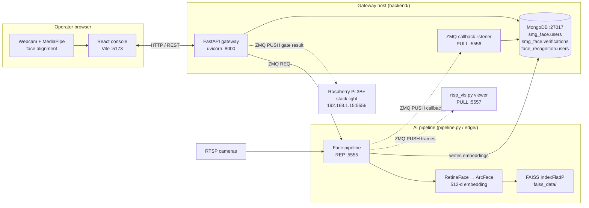

# Face Registration & Recognition (On-Prem)

This repository contains the complete on-premise face registration and recognition system for SMG. Operators register drivers and helpers from a browser console. A FastAPI gateway sends each face to an AI pipeline over ZeroMQ, and gate decisions go to a Raspberry Pi that drives a three-colour stack light. Nothing leaves the site network.

## Architecture



The link between the browser and the gateway is HTTP, because browsers can't open ZeroMQ sockets. Every link after the gateway is ZeroMQ.

## Components

### 1. Frontend (`frontend/`, React + Vite)
- Operator console
- Face capture with live alignment feedback (MediaPipe)
- Registration form (name, ID, vendor, role, licence expiry)
- Registered users view
- Single-person and two-camera verification, with a verification history
- Pipeline start/stop controls

### 2. Gateway (`backend/`, FastAPI)
- REST APIs for the frontend under `/api`
- Local MongoDB storage
- ZeroMQ orchestration of the pipeline
- Async pipeline callbacks on `:5556`
- Licence status and driver/helper role checks
- Sends the gate result to the Raspberry Pi

### 3. Face pipeline (`pipeline.py`, `edge/rtsp_pipeline.py`)
- RetinaFace detection and ArcFace embeddings (DeepFace)
- FAISS cosine-similarity search: a match needs ≥ 0.5, and registration rejects a duplicate at ≥ 0.6
- Modes: `registration`, `identification` and, in the edge build, `stop_identification`
- The edge build reads RTSP streams (every 5th frame) and sends frames to `edge/rtsp_vis.py`

### 4. Pipeline simulator (`pipeline_simulator.py`)
- ZeroMQ-based simulator for the AI pipeline
- Supports start/stop commands
- Simulates registration success/failure
- Used for integration testing and demos

### 5. Stack light controller (`automation/`)
- Raspberry Pi 3B+ with a relay and a 24 V three-colour tower light
- Runs as the `smg-controller.service` systemd unit
- See `automation/readme.md` for the hardware setup

## Flows

**Register:** `POST /api/register` saves the profile as `PENDING`. The gateway then sends `{mode: "registration"}` to the pipeline. The pipeline embeds the face, checks FAISS for a duplicate, and stores the embedding in `face_recognition.users`. The user's status is updated from the pipeline's reply.

**Verify one person:** `POST /api/verify` returns a `request_id`. The pipeline identifies the face, and the gateway adds the person's profile and licence status to the result. The frontend polls `GET /api/verify/{request_id}`. `POST /api/verify/bypass/{id_number}` looks a person up by ID when the face fails.

**Gate a vehicle:** `POST /api/verify/two-camera` identifies the driver-side frame (camera 1) and the helper-side frame (camera 2). Camera 1 must show a registered **driver** with a valid licence. Camera 2 may show a helper, or nobody. The overall result is pushed to the Raspberry Pi.

Licence status: **VALID** means more than 10 days left, **EXPIRING_SOON** means 10 days or fewer, and **EXPIRED** means past the expiry date.

## Ports

| Endpoint | Owner | Pattern | Used for |
|---|---|---|---|
| `:5173` | frontend | HTTP | Operator console (dev server) |
| `:8000` | backend | HTTP | REST API under `/api` |
| `:5555` | pipeline | ZMQ REQ → REP | Registration, identification, start/stop |
| `:5556` | backend | ZMQ PUSH → PULL | Pipeline callbacks (`REGISTRATION_RESULT`, `VERIFICATION_RESULT`) |
| `192.168.1.15:5556` | Raspberry Pi | ZMQ PUSH | Gate decision for the stack light |
| `:5557` | edge pipeline | ZMQ PUSH → PULL | Annotated frames for `rtsp_vis.py` |
| `:27017` | MongoDB | TCP | Set with `MONGO_URL` in the backend |

## Quick start

```bash
./setup.sh              # creates backend/venv and installs frontend packages
./run.sh                # starts the backend (:8000) and frontend (:5173)
python pipeline.py      # or: python pipeline_simulator.py for demos
```

MongoDB must be running on `localhost:27017`. To run the edge RTSP pipeline and its viewer, use `edge/run.sh` and `edge/stop.sh`. See the README in each folder for details.

## Known gaps

- `automation/main.py` is empty, so the Raspberry Pi relay controller code still needs to be added.
- `pipeline.py` reads only the `mode` field, so it rejects the gateway's `START_PIPELINE` / `STOP_PIPELINE` commands. Only the simulator handles them.
- In `edge/rtsp_pipeline.py` the PUSH socket to the viewer is commented out but still used.
- The Pi address and the `localhost` addresses are hard-coded. Move them to environment variables before you deploy to a new site.
